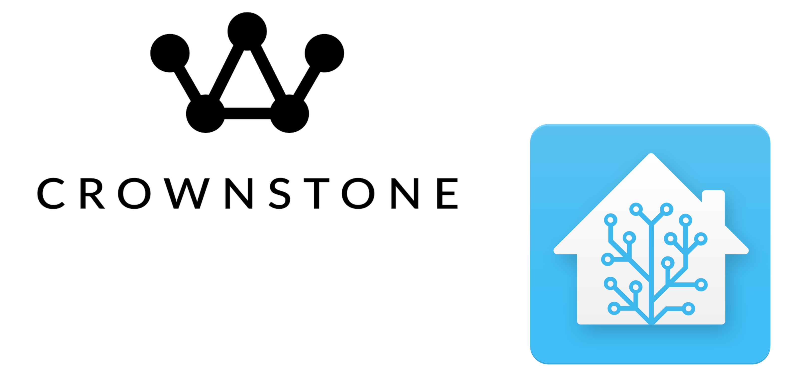
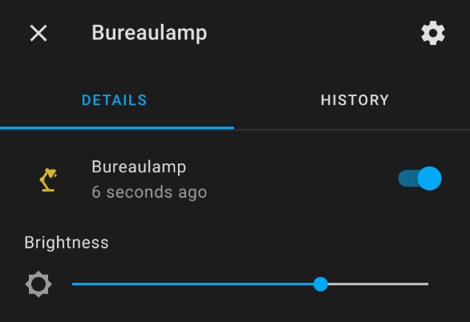
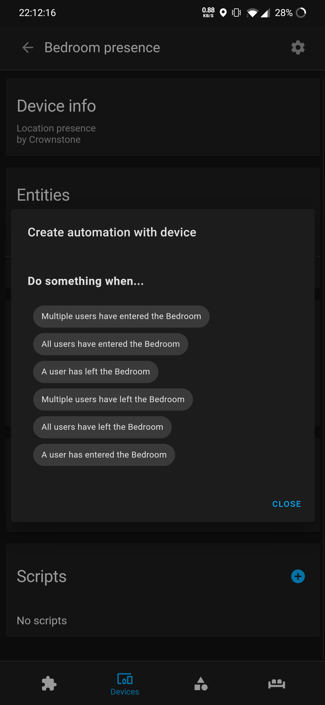
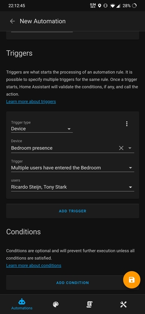

# Crownstone Home Assistant Integration

# Features

Welcome to the Crownstone integration, a very advanced integration for Home Assistant!

The supreme versatility and user friendliness of the Crownstones is reflected into this integration by the following features:

* Extremely easy to set up
* Instant updates for switch states and data
* Dynamically adding and removing devices/entities
* Real-time power usage measurements using the Crownstone USB
* Keeps track of **who** is in which room!
* Custom advanced presence triggers to make your whole home react to your presence!

This integration stays in one line with the Crownstone app. When data is updated, Crownstones added/deleted or Locations added/deleted, the changes are **instantly** made in Home Assistant as well, thanks to our amazing Server Send Event service!

# Installation

## HACS

Visit the [HACS installation page](https://hacs.xyz/docs/installation/manual) to set up HACS in your Home Assistant.

Click the 3 dots button in the top right corner, and click custom repositories. Select category integration, and add the link of this repository. In the HACS store, click the "+" button in the bottom right corner, and search for Crownstone.

## Manually

Copy all files from custom_components/crownstone/ to custom_components/crownstone inside your HA config folder.

# Crownstones

Crownstone are represented in the light platform, and can switch or dim. You can create a card in the overview and add your Crownstone entities to have a nice overview of your Crownstones! If a Crownstone supports dimming, there will be a brightness slider to dim your Crownstone.

When the ability state of **dimming** is changed through the Crownstone app, your config entry will reload to process the change in supported features. This means that some states may be different, and the power usage is likely back to 0W.  

Crownstone entities have some state attributes to provide more information about the Crownstone. To see this information, simply click on the entity. This information is:
* Switch method (Crownstone Cloud or Crownstone USB Dongle)
* Dimming (Enabled or Disabled)
* Tap To Toggle (Enabled or Disabled)
* Switchcraft (Enabled or Disabled)

# Presence

The unique selling point of Crownstone, the presence on room level, is also available in Home Assistant!

The state sensor is a string of the first names of the people who are in the room. It is possible for multiple people to be in the same room, the names of the users is separated by a comma.

Apart from the room presence there is also sphere presence. this shows who is currently in the sphere (house, apartment). If a user is at home (in the sphere), the user's name will be shown in sphere presence and one of the room presence entities.

The Crownstone app is leading the presence functionality, for any issues with your presence detection make sure to go to your Crownstone app and retrain your rooms. 4 Crownstones are required for the localisation on room level. If you don't have 4 Crownstones, it will only show your presence in the sphere (house).

## Presence device triggers

In order to create automations with the Crownstone presence detection on room level, device triggers are available. This way, you can use the Crownstone presence to turn on Hue lights, speakers or other awesome devices!

The following device triggers are available for the Crownstone presence devices:
- A user has left a room / the house
- A user has entered a room / the house
- Multiple users have entered a room / the house
- Multiple users have left a room / the house
- All users have entered a room / the house
- All users have left a room / the house

### Setting up an automation using the UI

This is the only possible option since it uses a device_id to identify the devices.

- go to configuration -> automations. You can skip the automatic automation generation as it usually doesn't work too well.
- go to configuration -> devices -> select device -> new automation -> select a trigger.

The names of the users are their **full name**, So first name + last name. You can see what name you have configured by entering the Crownstone app, and going to Settings -> My Account.

Note that these triggers are `event based`. Multiple users and all users triggers are experimental. Let's say a trigger will execute an action when 3 people have entered a room. The action will ONLY execute when there's an enter event received for every one of the users. 

The events are registered, which means that if a user enters a room, but leaves shortly after, the event for entered stays registered. If the other 2 users in the trigger then enter the room, the action will STILL execute. Make sure you select the correct trigger for the occasion. Using a single user trigger to execute an action will always be the safest option.

 

# Power usage

Crownstone's live power usage streaming is also available in Home Assistant. Because of the constant updates, this functionality is only available when using the [Crownstone USB dongle](#crownstone-usb-dongle).

The power usage for each Crownstone updates every minute, or instantly for a particular Crownstone when switching it. It can take some time before the correct power usage is displayed.

## Power usage device triggers

Power usage entities use the default device triggers from sensor for power usage sensors. The following triggers are available:
- Crownstone Power usage energy changes

For `Crownstone Power usage changes` there are 3 options:
- Above a certain value
- Below a certain value
- Duration of the change in hh/mm/ss

You can have other devices react to peaks in power usage, send an event or notification, whatever you like!

 

# Comparison

The integration works with the Crownstone Cloud and the Crownstone USB dongle. The differences between the two are only relevant for the Crownstones. The integration uses the Crownstone Cloud by default, to use the Crownstone USB you'll have to purchase one from the Crownstone store.

Presence updates and data updates are always done using the Crownstone Cloud.

## Crownstone Cloud

- [x] Switching Crownstones
- [x] Dimming Crownstones
- [x] State updates in Home Assistant when switching from Crownstone app
- [x] Can switch multiple Crownstones at once
- [ ] No delay when switching Crownstones
- [ ] State updates in Home Assistant when using lightswitch with Switchcraft
- [ ] Can switch Crownstones independently (no smartphone in proximity required)
- [ ] Can use power usage entities

## Crownstone USB Dongle

- [x] Switching Crownstones
- [x] Dimming Crownstones
- [x] State updates in Home Assistant when switching from Crownstone app
- [x] Can switch multiple Crownstones at once
- [x] No delay when switching Crownstones
- [x] State updates in Home Assistant when using lightswitch with Switchcraft
- [x] Can switch Crownstones independently (no smartphone in proximity required)
- [x] Can use power usage entities

Get your Crownstone USB dongle [here](https://shop.crownstone.rocks/products/crownstone-usb-dongle) and enhance your Home Assistant experience!

# Testing

To ensure the best possibly experience with the Crownstone Home Assistant integration, thoroughly testing is required. You can find a test rapport [here](test_rapport.md). 

This rapport shows exactly what tests have been done, and what the result was. 
If you like to contribute test results of tests that have not been done by us yet, you can post an issue with the test & the result. We will adjust the rapport accordingly including credit.

# Roadmap

- [ ] Publish initial Crownstone integration to Home Assistant Core (in progress)
- [x] Optimize configuration flow for easier setup
- [x] Create device triggers for Presence devices
- [x] Add power usage entities to Crownstone devices
- [x] Fix state updates coming from the Crownstone app not being done in Home Assistant
- [x] Dynamically update data & add/remove Crownstone and Location devices without restarting or reloading
- [ ] Create device conditions for Presence devices
- [ ] Optimize power usage accuracy by implementing new UART protocol

Any ideas for future updates? Let us [know](mailto:ask@crownstone.rocks?subject=[GitHub]%20Crownstone%20Home%20Assistant%20Integration)!