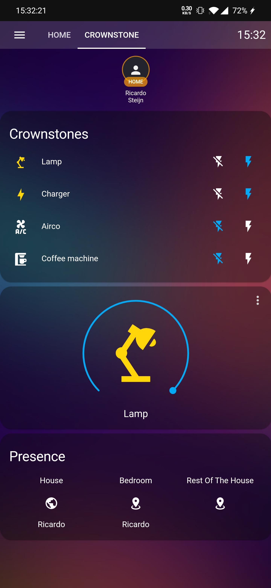

# Crownstone Home Assistant Integration

This is the HACS repository for the Crownstone Home Assistant integration!

This repo contains files that are not available yet in Home Assistant Core. The main purpose is to make the integration available for testing. If you're using this integration and encounted a bug, please post an issue with the problem so we can resolve it.

Also, if you have any great ideas to make the integration even better, let us know!

  

# Installation

## HACS

Visit the [HACS installation page](https://hacs.xyz/docs/installation/manual) to set up HACS in your Home Assistant.

Click the 3 dots button in the top right corner, and click custom respositories. Select category integration, and add the link of this repository. In the HACS store, click the "+" button in the bottom right corner, and search for Crownstone.

## Manually

Copy all files from custom_components/crownstone/ to custom_components/crownstone inside your HA config folder.

# Features

The Crownstone integration currently supports the following features:

## Switching and dimming Crownstones

Crownstone are respresented in the light platform. You can create a card in the overview and add your Crownstone entities to have a nice overview of your Crownstones! If a Crownstone supports dimming, there will be a brightness slider to dim your Crownstone.

The default communication method to switch and dim Crownstones, is the cloud. Using a cloud, it can take 1-3 seconds before a crownstone switches. However, we added support for the Crownstone USB in Home Assistant. Plug the USB in and start Home Assistant, it should automatically start switching using the USB. Since the latencies are so low using the USB, switching and dimming will be instant!

### Crownstone ability updates

Currently, the Crownstone integration supports updating a Crownstone's ability during runtime. Once changed in the app, Home Assistant will reload your config entry, and re-initialize all your Crownstone entities.

## Presence sensor

The unique selling point of Crownstone, the presence on room level, is also available in Home Assistant!

The state sensor is a string of the first names of the people who are in the room. It is possbile for multiple people to be in the same room, the names of the users is separated by a comma.

Apart from the room presence there is also sphere presence. this shows who is currently in the sphere (house, apartement). If a user is at home (in the sphere), the user's name will be shown in sphere presence and one of the room presence entities.

The Crownstone app is leading the presence functionality, for any issues with your presence detection make sure to go to your Crownstone app and retrain your rooms. 4 Crownstones are required for the localisation on room level. If you don't have 4 Crownstones, it will only show your presence in the sphere (house).

## Presence device triggers

In order to create automations with the Crownstone presence detection on room level, device triggers are available. This way, you can use the Crownstone presence to turn on Hue lights, speakers or other awesome devices!

The following device triggers are available for the Crownstone presence devices:
- A user has left a room / the house
- A user has entered a room / the house
- Multiple users have entered a room / the house
- Multiple users have left a room / the house
- All users have entered a room / the house
- All users have left a room / the house

### Setting up an automation using the UI

This is the only possible option since it uses a device_id to identify the devices.

- go to configuration -> automations. You can skip the automatic automation generation as it usually doesn't work too well.
- go to configuration -> devices -> select device -> new automation -> select a trigger.

The names of the users are their **full name**, So first name + last name. You can see what name you have configured by entering the Crownstone app, and going to Settings -> My Account.

Note that these triggers are `event based`. Multiple users and all users triggers are experimental. Let's say a trigger will execute an action when 3 people have entered a room. The action will ONLY execute when there's an enter event received for every one of the users. 

The events are registered, which means that if a user enters a room, but leaves shortly after, the event for entered stays registered. If the other 2 users in the trigger then enter the room, the action will STILL execute. Make sure you select the correct trigger for the occasion. Using a single user trigger to execute an action will always be the safest option.

# Troubleshooting

1. When I switch my Crownstone using the app, the change isn't visible in Home Assistant, why?

We chose not to update the state in Home Assistant externally because the state isn't always known. When using switchcraft for example, the state of the Crownstone is not updated in the cloud. The safest option is to only let Home Assistant change the state of it's entities. The Crownstone entities use assumed state which means you will ALWAYS be able to switch your Crownstones using Home Assistant, independed of the state in the app.

2. I updated some data / Crownstone firmware in the Crownstone app, but it is not updated in Home Assistant

Dynamically updating data is not yet supported for the Crownstone integration. To register the changes in HA, you'll have to restart.

3. Will there be an option to use power usage as trigger in Home Assistant?

The power usage feature is on the roadmap for upcoming updates. Likely this will come whenever the Crownstone hub is finished.
